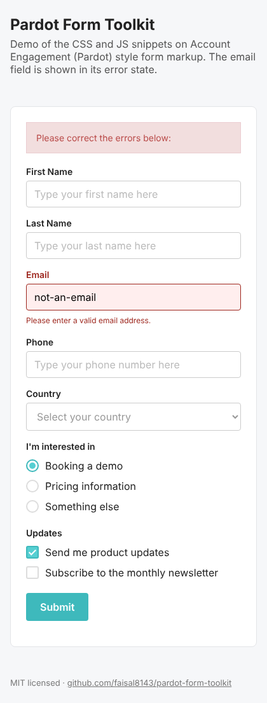

# Pardot Form Toolkit

Drop-in CSS and vanilla JS snippets for styling and improving **Salesforce Account Engagement (Pardot)** forms — custom checkboxes and radios, clean error states, placeholders and HTML5 field attributes. No jQuery, no icon fonts, no build step.

**[Live demo →](https://faisal8143.github.io/pardot-form-toolkit/)**



## What's included

| File | What it does |
|---|---|
| `css/pardot-checkbox.css` | Custom, accessible checkboxes for `.pd-checkbox` fields (pure CSS tick) |
| `css/pardot-radio.css` | Custom, accessible radio buttons for `.pd-radio` fields |
| `css/pardot-error-states.css` | Styles Pardot's `p.errors` banner, `.error` fields and field-level messages |
| `css/sticky-footer.css` | Keeps the footer at the bottom of short landing pages and CloudPages |
| `js/field-attributes.js` | Adds native `required`, placeholders, `maxlength`, `type` and `autocomplete` to fields |
| `js/select-placeholder.js` | Turns the blank first option of dropdowns into a disabled "Select…" prompt |
| `js/label-to-placeholder.js` | Moves label text into placeholders (adds `*` for required) and hides labels accessibly |

All colours are CSS custom properties (`--pft-accent`, `--pft-error`, …), so you can re-brand by overriding a few variables.

## Usage

### 1. CSS — Layout Template

In Account Engagement go to **Content → Layout Templates → (your template) → Layout tab** and paste the CSS inside a `<style>` tag in the `<head>`, or link to it:

```html
<link rel="stylesheet" href="https://cdn.jsdelivr.net/gh/faisal8143/pardot-form-toolkit@main/css/pardot-checkbox.css">
<link rel="stylesheet" href="https://cdn.jsdelivr.net/gh/faisal8143/pardot-form-toolkit@main/css/pardot-radio.css">
<link rel="stylesheet" href="https://cdn.jsdelivr.net/gh/faisal8143/pardot-form-toolkit@main/css/pardot-error-states.css">
```

To re-brand, override the variables after the stylesheets:

```html
<style>
  :root { --pft-accent: #e4002b; --pft-accent-dark: #b00020; }
</style>
```

### 2. JS — Form "Below Form" section

Open the form → **Look and Feel → Below Form** → switch to HTML source and paste:

```html
<script src="https://cdn.jsdelivr.net/gh/faisal8143/pardot-form-toolkit@main/js/field-attributes.js"></script>
<script src="https://cdn.jsdelivr.net/gh/faisal8143/pardot-form-toolkit@main/js/select-placeholder.js"></script>
```

Edit `FIELD_CONFIG` in `field-attributes.js` to match your field names (the class Pardot puts on each field's `<p>`, e.g. `first_name`, `email`, `company`).

Use **either** `field-attributes.js` **or** `label-to-placeholder.js` for placeholders, not both.

> Tip: for production, copy the files into your own Account Engagement **Files** (or Marketing Cloud Content Builder) and reference them from there instead of a public CDN.

## Markup it expects

The snippets target the standard markup Account Engagement renders:

```html
<form class="form" id="pardot-form">
  <p class="form-field email pd-text required">
    <label class="field-label" for="email">Email</label>
    <input type="text" id="email" name="email">
  </p>
  <p class="form-field opt_in pd-checkbox">
    <label class="field-label">Updates</label>
    <span class="value"><span>
      <input type="checkbox" id="opt_in_0"><label class="inline" for="opt_in_0">Yes</label>
    </span></span>
  </p>
</form>
```

## Browser support

All evergreen browsers (Chrome, Edge, Firefox, Safari). No IE support.

## Contributing

Issues and pull requests are welcome — especially new snippets for common Account Engagement or Marketing Cloud CloudPages form problems.

## License

[MIT](LICENSE) © Faisal Irfan
